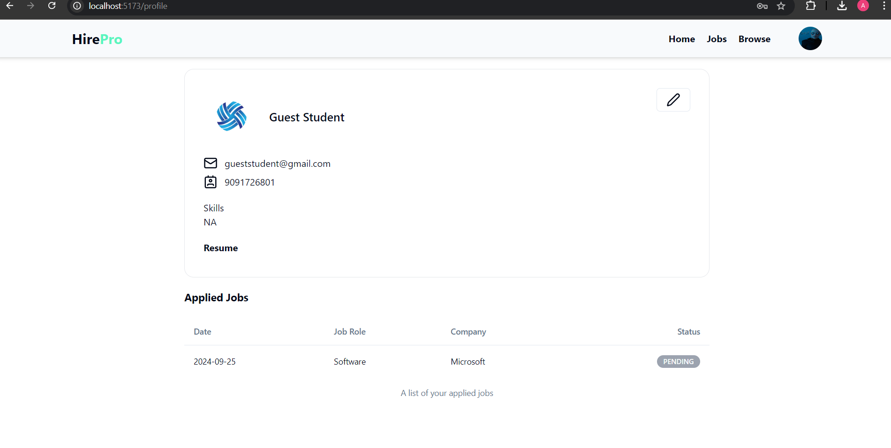

# HirePro - Job Portal Website

**HirePro** is a comprehensive job portal application designed to streamline the job search, recruitment, and application process for both job seekers and startups. Built using **React.js**, **Node.js**, **Express**, and **MongoDB**, HirePro serves as a centralized platform where users can access job listings, apply for positions, and manage their job-related activities, enhancing their overall career experience.

## Key Features:

### 1. Personalized Dashboard

- Quick access to relevant job opportunities ensures that job seekers stay informed about open positions, application deadlines, and startup updates.

### 2. Interactive Job Listings Management

- Startups can manage job posts, edit listings, and track the status of applications.
- Seamless communication between startups and job seekers ensures better collaboration.

### 3. Save and Bookmark Job Posts

- Users can **save job listings** they find interesting or relevant, creating a personalized collection of saved content for future reference.
- This feature ensures that important opportunities are easily accessible and helps users stay organized during their job search.

### 4. Real-time Job Updates

- Startups can post real-time updates about job vacancies, ensuring that users are always informed about the latest openings, deadlines, and changes within the job market.

### 5. User-Friendly Interface

- The application features an intuitive and user-friendly interface, making it easy for users to navigate and access the information they need.

## Benefits:

- **Enhanced Communication**: Facilitates effective communication between startups and job seekers, improving coordination and collaboration during the hiring process.
- **Timely Information**: Users receive timely updates on job postings, application statuses, and other important announcements.

## Features:

- **Startup Admin**: Can create, edit, delete, and view job posts.
- **User Accounts**: Job seekers can create accounts, update profiles, and upload resumes.
- **Form Validation**: Includes form validation for user registration, login, and job applications.
- **Security**: JWT implementation for secure user authentication, with password encryption and decryption using **bcrypt**.

## Results:

| Title                   | Screenshot                                    |
| ----------------------- | --------------------------------------------- |
| **Landing Page**        |            |
| **Registration Page**   |     |
| **Login Page**          |            |
| **Recruiter Dashboard** | ! |
| **Job Listing**         |              |
| **Job Description**     |       |
| **Browse Jobs**         |           |
| **User Profile**        |          |

## Backend Code:

You can find the backend code for the **HirePro** Job Portal at:  
[Backend Repository](https://github.com/AbhiIkhar/HirePro-Backend)

## Conclusion:

**HirePro** is an efficient job portal that bridges the gap between **startups and job seekers** by providing a centralized platform for recruitment, job searching, and engagement. It improves communication, streamlines the job search process, and enhances user experience through real-time updates and personalized features.
